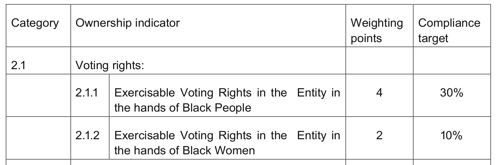

# Making the computer speak BEE

What do web pages, numeric computing, knitting and BEE have in common? Not much, it seems. But I have a suggestion: They can all benefit from *domain-specific programming languages*.

I'm a software developer at Mpowered. I came here after many years of programming language research at [Chalmers University](https://www.chalmers.se). More specifically, my area was in domain-specific programming languages (DSLs). These are "little languages" that are made to solve problems in a limited domain. As such, they are designed to speak the language of the *domain expert* rather than the programmer.

This post will present DSLs in general, demonstrate some of the uses of DSLs at Mpowered, and show some ideas we are exploring for the future.


## DSL examples

There are a wide range of DSLs available for different purposes. Here follows a few examples.

### HTML

HTML is the main language for the front end web developer. It allows you to describe the contents of web pages in a structured form. Here is a simple piece of HTML:

```html
<h1>Free time</h1>

Things I like to do in my free time:

<ul>
  <li>Swimming in the sea</li>
  <li>Watching birds</li>
</ul>
```

This little snippet may get rendered into something like the following in the front end:

> <b>Free time</b>
>
> Things I like to do in my free time:
>
>   * Swimming in the sea
>   * Watching birds

Note how the HTML code captures exactly the intention of the text -- no more and no less. For example, it does not dictate a certain font or letter size. It doesn't even say whether the list items should be marked by bullets or something else. `<ul>` simply stands for "unordered list", and `<li>` stands for "list item".

### MATLAB

[MATLAB](https://en.wikipedia.org/wiki/MATLAB) ("MATrix LABoratory") is a programming language for numerical processing. It aims to make such programs easier to write by supporting notation familiar to mathematicians. A large part of our daily lives are built around data processing units -- for example TV sets, mobile phones and base stations, control systems in smart cars, etc. There's a high probability that these programs are based on mathematical equations that have first been prototyped and tested in MATLAB. Some applications even run directly in MATLAB and its associated tooling.

### Kitting stitch patterns

Just to throw in a bit of a wild card into the mix: there is even a DSL for [kitting patterns](https://www.knittingstitchpatterns.com).

How about this program for making a ["pie crust basketweave"](https://www.knittingstitchpatterns.com/2014/08/pie-crust-basketweave.html) pattern:

```
Knitted in a multiple of 8, +2 sts and a 8-row repeat.
Row 1 - Wrong side:  Purl 2 * knit 6, purl 2; repeat from * to end.
Row 2 - Right side: Knit 2, * purl 6, knit 2; repeat from * to end.
Row 3: As Row 1.
Row 4: Knit.
Row 5: Knit 4, purl 2, * knit 6, purl 2; repeat from * to last 4 sts, knit 4.
Row 6: Purl 4, knit 2, * purl 6, knit 2; repeat from * to last 4 sts, purl 4.
Row 7: As Row 5.
Row 8: Knit.
```


I admittedly have no idea how to read the above. But to someone who knows the language, it makes perfect sense. Again, the point is that it captures exactly the right amount of information for creating the pattern. It does not say anything about color or thickness of the thread, for example.


## Taking advantage of your limitations (how less is more)

The main advantage of DSLs is the fact that they can be used by domain experts who are not necessarily programmers in the ordinary sense. But this is not just a matter of understandability. By limiting the kinds of programs one can write, we can actually do *more* things with them than we can with programs in general-purpose languages.

A good illustration is HTML, which does not by itself support any kind of computations or actions (such as reading/writing to/from the disk, starting other programs, etc.). Because of this limitation, we can do things with HTML pages that we generally cannot do with ordinary programs (written in Java, say):

  * We can interpret the same HTML page in different ways -- with different styles and layouts, for example.
  * We can analyze the page, e.g. to see what other pages it links to.
  * We can split the page in parts and render each section in parallel.
  * Etc.


## DSLs at Mpowered

The main application provided by Mpowered is the B-BBEE compliance software [BEEtoolkit](https://mpowered.co.za/beetoolkit/). At the core of BEEtoolkit are the scoring calculations defined by the various sector codes from the [B-BBEE Commission](https://www.bbbeecommission.co.za/b-bbee-codes-of-good-practice/).

As many of the readers will know, the sector codes are divided over several *elements* (Ownership, Management, Skills Development, etc.), and each element defines a number of *indicators* which make up the score of the element.

The sector code documents use a very brief format to define the indicators.



The above table shows the first two Ownership indicators of the amended ICT codes. Note how the table covers only the essential information related to each indicator: the measured value ("Exercisable Voting Rights ..."), the compliance target and the weighting points.

The indicator tables speak the language of the BEE expert. Wouldn't it be nice if the BEEtoolkit software could understand this language as well?

Indeed, our code has a DSL for indicator definitions. (And to be clear, this DSL was in place before I started here.) Here is what the above indicators look like in our DSL:

```yaml
voting_rights:
  black_people:
    total: 100
    points: 4
    target: 0.3
    actual: exercisable_voting_rights_of_black_people
    amount_type: percentage
    description: Exercisable voting rights of black people
    actual_description: Voting rights of black people
    total_description: Total voting rights
  black_females:
    total: 100
    points: 2
    target: 0.1
    actual: exercisable_voting_rights_of_black_females
    amount_type: percentage
    description: Exercisable voting rights of black females
    actual_description: Voting rights of black females
    total_description: Total voting rights
```

(Some readers will recognize the above snippet as being embedded in the [YAML format](http://www.yaml.org/). This is only an implementation technicality. It is still a DSL in the sense it speaks to the domain experts and gets interpreted according to the rules of BEE.)

We recognize the key information from the table in the sector codes, although laid out slightly differently. There are also some extra descriptions and formatting in there, which is used when the indicators get presented in various parts of our system. This extra information is definitely part of the domain, and thus makes sense to support in the DSL.

Additionally, the sector codes often define side-conditions that change the parameters of an indicator, etc. Our DSL is able to capture these variations as well, but we're not going into the details here.

Note that the above definitions are the *single source of truth* for said indicators in our system. That code is accessed every time a user opens up a scorecard in the browser, downloads a PDF report, etc. This also means that a BEE expert could, in principle, tweak an indicator throughout the whole system without knowing the slightest about programming in general.


## Summary and discussion

There is often a big gap between the notation used for specifying or explaining how a program works and the code used to implement that program. Domain-specific languages can be used to bridge that gap, making the specification and implementation be the same thing.

Additionally, well-designed DSLs permit flexible interpretations and analyses that are typically out of range in general-purpose code.

DSLs range all the way from highly specialized (and rather simple) ones, such as our DSL for BEE, to widly used and standardized ones, such as HTML. Don't be afraid to make one yourself, if there's nothing suitable available already!

Finally, it should be mentioned that DSLs don't have to be entirely separate languages. Well-designed libraries in ordinary programming languages can also be made to provide DSL-like vocabularies. An example of this is the [RSpec library](https://rspec.info/) for testing Ruby code. In fact, putting on the DSL thinking hat while designing libraries can actually help us making them more robust and easier to work with.
